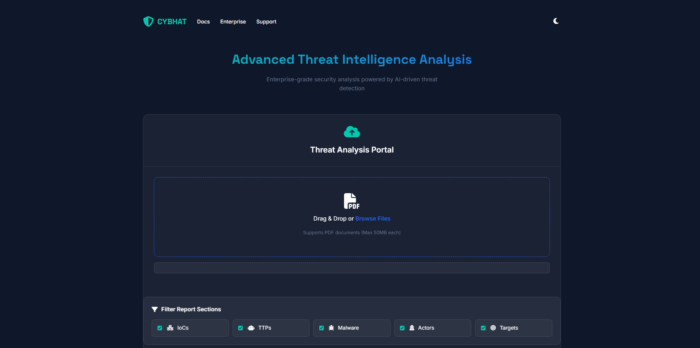
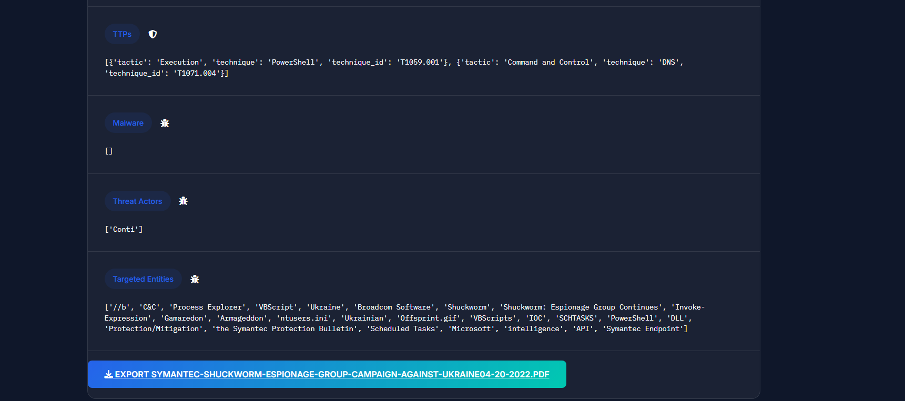

# CYBHAT-Threat-Intelligence-IITK-Hackathon-final-project

# CYBHAT: Automated Threat Intelligence Extractor

  

## 👥 Team CYBHAT
*This project was developed in Jan 2025 for the **HACK IITK Cybersecurity Challenge 2024**.*

* **Sahil Sudhir Dehadray** (Team Leader)
* **Abhinav Galagali**
* **Djatassiba Yaovi Joel**
* **Tharun**

## 🙏 Acknowledgements
* **C3iHub, IIT Kanpur**: For organizing the challenge and providing the problem statement.
* **Powered by**: SpaCy, PyMuPDF, and the VirusTotal API.

## 📋 Overview

**CYBHAT** is an automated tool designed to extract actionable threat intelligence from unstructured data sources. It processes reports in **PDF, DOCX, and TXT** formats to identify and classify key threat indicators using Natural Language Processing (NLP) and Machine Learning.

Manual analysis struggles to keep pace with the volume of cyber threat data. This tool bridges that gap by rapidly identifying Indicators of Compromise (IoCs), TTPs, and threat actors, transforming reactive defenses into proactive strategies.

## ✨ Key Features

* **Multi-Format Support:** Extracts text and intelligence from PDF (including scanned docs via OCR), DOCX, and TXT files.
* **IoC Extraction:** Uses regex to identify IPs, MAC addresses, Domains, URLs, File Hashes (MD5/SHA), and Registry Keys.
* **MITRE ATT&CK Mapping:** Automatically maps text to specific tactics and techniques (e.g., Phishing, T1566) within the MITRE framework.
* **Malware & Actor Detection:** Leverages SpaCy NER and Transformer models to identify malware names and threat actors.
* **Data Enrichment:** Integrates with the VirusTotal API to enrich extracted malware data with metadata.
* **JSON Export:** Outputs structured JSON files for easy integration with other security tools.

## 🏗️ Architecture

The application follows a linear pipeline: **Input Validation -> Text Extraction -> Intelligence Mining -> Output Generation**.

> **Note:** The logic combines regex precision for IoCs with the flexibility of Transformer models for Named Entity Recognition.

## ⚙️ Prerequisites

Ensure you have the following installed:
* Python 3.7+
* Tesseract OCR (for scanning non-machine-readable PDFs)
* VirusTotal API Key (optional for enrichment)

## 🛠️ Installation

### Steps

1.  **Clone the repository**
    ```bash
    git clone [https://github.com/Hacker2022-web/CYBHAT-Threat-Extractor.git](https://github.com/Hacker2022-web/CYBHAT-Threat-Extractor.git)
    cd CYBHAT-Threat-Extractor
    ```

2.  **Install Dependencies**
    ```bash
    pip install -r requirements.txt
    ```

3.  **Download NLP Models**
    The project requires the SpaCy English language model:
    ```bash
    python -m spacy download en_core_web_sm
    ```

4.  **Configure API Key**
    Open `threat_analyzer.py` and add your VirusTotal API key to the `get_malware_metadata` function:
    ```python
    api_key = 'YOUR_API_KEY_HERE'
    ```

## 🚀 Usage

Running the application is simple. CYBHAT comes with a built-in web dashboard for easy analysis.

### 1. Start the Server
Run the Flask application using the command line:

```bash
python app.py
#Open your web browser and go to: (http://127.0.0.1:5000)
```


*Fig 1. Drag and Drop Interface*

### 2. Analyze Reports
1. Drag and drop your PDF threat reports into the upload zone.
   > **Tip:** Don't have a report handy? Use the [sample_report.pdf](samples/sample_report.pdf) provided in the `samples/` folder to test the tool immediately.

## 📘 Project Documentation
For a deep dive into the problem statement, methodology, and future scope, view our **[Hackathon Presentation Slides](docs/CYBHAT_Presentation.pdf)**.
